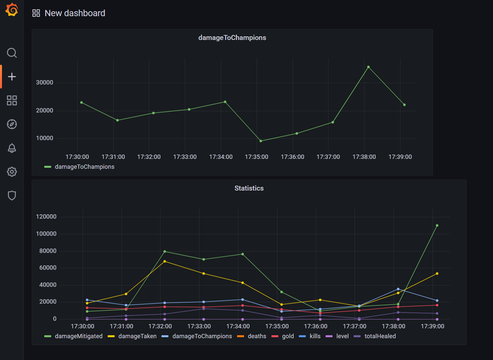

# Introduction
Website riot user submission can be found here [riotAPI](https://aronblog.net/riot.html)
<br></br>
This application is supposed to get the user's last 20 games and display various statistics on a dashboard and table. My first get node is supposed to return an array with the last 20
games played. Each object in the array has the format ```"NA1_#########"```. This is then passed through two function nodes that digest the information so that the next get request
can read the information. The get request accepts the information by modifying its URL to include the payload so it can get statistics about each game. The ``` /lol/match/v5/matches/{matchId} ```
returns a 30,000 line JSON object that I then break down to only include a specific player. I then send this to rate limiter node that restricts the message rate to 1 payload per minute so that
the values are not all in the same time queries. The object returned will be the msg.payload.info.participants[i] object which will only be statistics about a single user.
This goes into two other function nodes and is formatted so that it can be sent to **InfluxDB**. InfluxDB has two buckets, one storing statistics, and the other storing the match id and champion name. If needed, I can also choose to display single statistics on **Grafana**. The environment used
is just **Docker**. All resources used were deploying using docker-compose, and influxdb buckets are automatically provisioned using the docker_influxdb_init feature. 

# Problems I Encountered
- First time sending information to InfluxDB I ran into some ```  unsupported input type for mean aggregate: string ``` error due to the query aggregate defaulting to mean. To display strings just set the query aggregate to last.
- Getting the dots to be connected in my InfluxDB graph was confusing since, the solution was to make everything the same query by removing the match id and placing it into another bucket
- I also wanted to implement a counter but nodered resets the variable everytime the timestamp is pressed or the nodes are redeployed. To fix this I implemented this ``` var local=context.get('data') || {};
if (local.count===undefined)//test exists
{
  local.count=0;
}
local.count +=1;
if (local.count == 20) {
    local.count=0;
}
context.set('data',local);```, although this didn't fix my time series problem.
- When sending information to my InfluxDB table, the time would always be the same for all inputs. Solution to this was to add a rate limiter node to limit the messages to 1 per minute.
- How to automatically provision two buckets at once through docker-compose since I was already able to provision one.
# Things I learned
- Nodered global variables and API requests
- Further understood **Docker** and **Docker-compose**
- How to navigate InfluxDB and populate the graph and table with information
- How to create **Grafana** dashboards using InfluxDB
- Riot API
- In nodered you can't use the API Gateway invoke url instead you have to use http://ip:1880/route instead
# Things I wanted to implement
- <s>Post request that replaces the username in the first get request but wasn't able to find much information about API Gateway and Lambda for nodered</s>
- Change the x axis on InfluxDB to be based off the number of games instead of time
# Conclusion 
Quite possibly my most favourite project till today, truly learned the significance of debugging and spending hours looking through documentation due to lack of examples. Might not be the best use of nodered and influxdb but it gave me opportunity to further explore these tools. I have extensively used league statistics to determine how I perform so creating a stat tracker seemed fun since alot of people use it. Looking forward to maybe using the live api on the discord server but I am moving on to **Jenkins** **Ansible** and Java data structures and algorithms. Hopefully I can get my application approved so I don't have to keep changing the api key. 

# Demo
### Requirements
- docker-compose 
https://docs.docker.com/compose/install/ 
- replace information in docker-compose.yml

- ``` cd infrastructure/ ```
- ``` docker-compose build ```
- ``` docker-compose up -d ``` 
- Find your host ip address and put localhost:1880 to access nodered (I used cloud9 so I found the ip by clicking share and copying the application ip)
- Go to the first get request connected with the timestamp and modifying the url to contain your own **puuid** and **api key**
- ``` https://americas.api.riotgames.com/lol/match/v5/matches/by-puuid/{REPLACE_PUUID}/ids?start=0&count=20&api_key={REPLACE_APIKEY} ```
- To find your puuid go here 
- ``` https://na1.api.riotgames.com/lol/summoner/v4/summoners/by-name/<REPLACE_SUMMONERNAME>?api_key=<REPLACE_APIKEY> ```
- Once in nodered click deploy
- Then click the timestamp
- Go to localhost:8086 (InfluxDB)
- Over the next 20 minutes, the table and graphs should start populating 
- To see the graph go to lolbucket and click stats and click submit
- To see single stats click one of the tag values and click submit
- For the grafana dashboards make sure to adjust the time ranges

# Screenshots 





